# CFPA2 Phase 2: VLM-Coordinated Multi-Robot Task Collaboration

## Research Proposal

**Project:** CFPA2 Phase 2 — Hierarchical VLM-Augmented Multi-Robot Collaborative Task Execution  
**Author:** Hasan (UCL Robotics Lab, supervised by Dimitrios Kanoulas)  
**Target:** ICRA 2027 (September 2026 submission)  
**Hardware:** Two Unitree Go2-W wheeled-legged quadrupeds, Mid-360 LiDAR, Jetson Orin Nano Super  

---

## 1. Landscape of Current Research

### 1.1 The Agentic Turn in Embodied AI

Between 2024 and early 2026, the embodied AI community underwent a paradigm shift: Vision-Language Models (VLMs) evolved from monolithic action generators into high-level cognitive controllers orchestrating perception, planning, verification, and replanning in closed loops. This "agentic" turn was driven by the failure of open-loop VLA systems in unstructured, dynamic environments where error accumulation over long-horizon tasks rendered success rates untenable.

**AgenticLab** (2026) formalized this as a model-agnostic benchmarking platform for closed-loop perception-verify-replan cycles in real-world unstructured settings. The **Agentic Robot** framework (2025) introduced the Standardized Action Procedure (SAP), decomposing the agentic loop into three specialized modules — Planner, Executor, and Verifier — achieving 79.6% success on the LIBERO benchmark by enforcing structured interaction protocols that reduce error propagation.

For long-horizon robustness, **RoboClaw** (2026) introduced Entangled Action Pairs (EAP) — coupling every forward manipulation with an inverse recovery action — enabling self-resetting data collection and dynamic policy scheduling under a VLM meta-controller. **R2VLM** (2026) addressed the computational bottleneck of long trajectories by employing a recurrent Chain-of-Thought (CoT) that maintains an evolving reasoning state, tracking temporal dependencies between subtasks without redundant processing of thousands of visual tokens. Test-time reflection methods further enhanced robustness by integrating look-ahead mechanisms where diffusion-based dynamics models predict visual outcomes of proposed actions before execution, enabling VLM self-critique that outperforms Monte Carlo Tree Search in complex multi-stage scenarios.

### 1.2 Memory Architectures for Extended Agency

As task horizons extend, interaction history management becomes a critical bottleneck. **MemOCR** (2026) introduced a 2D layout-aware visual memory system that renders interaction history into a structured visual canvas, achieving 8× token efficiency improvement over text serialization. The **Context-Folding** paradigm (2025) treats memory curation as a learnable skill: agents trained via reinforcement learning execute explicit editing operations on their own working memory, creating temporary branches for subtasks and folding completed sub-trajectories into concise summaries, achieving over 90% compression while maintaining performance on deep research benchmarks.

### 1.3 Multi-Agent Single-Task Coordination

The field has increasingly turned to Multi-Agent Robotic Systems (MARS) for tasks too complex or inefficient for a single robot. The **MARS Challenge** (NeurIPS 2025) benchmarked heterogeneous teams — humanoids, quadrupeds, and manipulators — on collaborative objectives requiring both high-level planning and physically realistic coordinated control.

A key challenge is the "scaling wall": increasing agent count degrades performance due to semantic noise in text-based communication. **L2-VMAS** (2026) addressed this by replacing natural language with dual latent memories (perception and thinking) synthesized in a shared latent space, avoiding information loss inherent in text encoding. **GauDP** (2025) integrated multi-agent local RGB views into a unified 3D Gaussian field, enabling each agent to adaptively query task-relevant features while maintaining its individual viewpoint. **VIKI-R** (NeurIPS 2025) used hierarchical reward signals to fine-tune VLMs on CoT demonstrations, then applied reinforcement learning to foster emergent compositional cooperation patterns among heterogeneous agents.

### 1.4 Multi-Agent Multi-Task Systems

The most complex realization involves multi-agent teams managing concurrent, asynchronous tasks. **ConEQsA** employs shared group memory with urgency-aware priority planning to schedule a single physical exploration path among multiple in-flight objectives. **IMR-LLM** (2026) addresses industrial multi-robot planning by using VLMs to construct disjunctive graphs solved by deterministic algorithms, with process trees guiding executable program generation. **CommCP** uses conformal prediction to calibrate inter-agent message confidence, ensuring robots only communicate information they deem relevant to partners' tasks.

### 1.5 Modular Agent Architectures

**InteractGen** decomposes robot intelligence into five specialized agents — Perceiver, Planner, Assigner, Validator, Manager — treating foundation models as regulated components within a closed-loop collective rather than a monolithic pipeline. This enables proactive human delegation and socially grounded service autonomy. The foundational **RoboVLMs** study (Nature Machine Intelligence, 2026) identified through 600+ experiments that VLM backbone choice, history aggregation strategy, and action space formulation are the primary drivers of VLA performance, advocating for policy head aggregation that processes historical observations separately before fusion.

---

## 2. Research Gaps

Despite rapid progress, several critical gaps remain unaddressed:

### Gap 1: No work generates formal multi-robot coordination plans from VLM reasoning

All existing multi-agent coordination strategies emerge through one of four pathways, none of which produce interpretable, verifiable coordination plans from a single VLM reasoning step:

| Existing Pathway | Representative Work | How Coordination Arises | Limitation |
|---|---|---|---|
| RL-trained emergent patterns | VIKI-R | Reward shaping over many training episodes | Requires extensive training; black-box; non-transferable across tasks |
| Latent space implicit coordination | L2-VMAS | Dual memory synthesis in learned latent space | Uninterpretable; no formal verification possible |
| Classical algorithm with VLM assistance | IMR-LLM | VLM constructs disjunctive graph; solver produces plan | Requires structured industrial task definitions; not applicable to vague prompts |
| Shared perception without explicit planning | GauDP | 3D Gaussian field fusion; each agent decides independently | No coordination plan exists; agents may conflict |

**No existing system asks a VLM to directly output a complete, formally structured multi-robot coordination plan.** The MARS Challenge report explicitly identifies "the production of high-quality, parallelized plans" as the primary remaining bottleneck. We address this directly.

### Gap 2: No formal verification of VLM-generated robot plans

Existing VLM-based robot systems validate plans through execution success or heuristic checks. No work applies formal methods — specifically temporal logic model checking — to verify whether a VLM-generated plan satisfies task-level specifications before execution. The Agentic Robot framework's Verifier module checks execution outcomes post-hoc, but does not verify plan correctness a priori. This gap is critical: a syntactically well-formed plan may contain subtle semantic errors (deadlocks, liveness violations, unmet ordering constraints) that only manifest during physical execution, wasting time and risking hardware damage.

### Gap 3: No information-theoretic analysis of multi-viewpoint coordination

Multi-agent perception systems like GauDP fuse observations empirically without theoretical grounding for when and why multi-viewpoint input improves coordination. No existing work provides an information-theoretic framework characterizing the relationship between observation complementarity (mutual information between viewpoints) and coordination plan quality. Without such a framework, system designers have no principled basis for deciding between single-viewpoint and multi-viewpoint architectures, or for predicting which task types benefit most from multi-robot sensing.

### Gap 4: No systematic VLM comparison for coordination reasoning

Benchmarks like LIBERO, MARS Challenge, and IMR-Bench evaluate system-level performance or single-robot manipulation capability. No benchmark isolates and compares different VLMs' ability to generate multi-robot coordination plans. The community lacks answers to basic questions: Can frontier VLMs reason about temporal coordination constraints? Do they correctly identify when collaboration is necessary? How do their failure modes differ?

---

## 3. System Architecture

### 3.1 Overview

We propose a hierarchical system where a cloud VLM coordinator synthesizes finite state machine (FSM) coordination plans from vague human instructions and dual-robot visual observations, executed through an abstract skill API with closed-loop re-planning. The system operates under Triple-Zero conditions: zero task-specific training, zero prior scene knowledge, zero manual skill programming.

### 3.2 Architecture Diagram



### 3.3 Communication Model

The system employs a hybrid communication architecture:

**Peer-to-peer (Robot ↔ Robot)** operates over ROS2 DDS at 10–50 Hz for low-latency reactive behaviors: partner collision avoidance, the FOLLOW skill, SYNCHRONIZE coordination, and SIGNAL message passing. This channel carries no images — only poses, skill status, and short semantic flags.

**Uplink (Robot → Cloud)** transmits hybrid state reports at ~1 Hz: a stitched RGB keyframe (two 640×480 views concatenated to 1280×480), a JSON scene graph from onboard YOLO detections, and an incremental narrative summary update from the onboard VLM. Transport is WiFi over HTTPS.

**Downlink (Cloud → Robot)** delivers FSM plans on two triggers: task initiation and re-planning events. This is event-driven, not periodic — the coordinator only pushes new plans when the current plan completes, fails, or requires revision based on periodic semantic review.

### 3.4 Onboard Perception: Fast Detector + Semantic Inspector + Spatial Memory

Each robot's Jetson Orin Nano Super (8 GB VRAM) runs a four-component perception stack. The design evolved from the original Narrative-VLM plan (TinyLLaVA digesting scenes into a text log) after empirical findings showed that **perception and planning must be decoupled** — an LLM performing both roles hallucinates coordinates faster than a dedicated perception stack can contradict them (see §3.9).

**YOLOv8n class-agnostic detector** (~100 MB VRAM, 5–25 Hz) produces bounding boxes regardless of COCO class label. Downstream layers treat the class name as a weak prior; the real semantics come from the inspector.

**IoU tracker (SORT-lite)** assigns stable track IDs across frames at a negligible compute cost. A track that persists for ≥3 frames is treated as a real object candidate; flickers are dropped.

**CLIP semantic inspector** (openai/clip-vit-base-patch32, ~600 MB VRAM, 5 Hz) scores each tracked crop against a fixed open-vocabulary query set (e.g. *"red button"*, *"door"*, *"wall"*, *"other robot"*). A **temporal softmax pool** sums the per-query probability vectors across the last 5 frames of each track, normalizes by window length, and reports the top query plus pooled confidence. Stable tracks dominate single-frame noise: five consistent `red button` detections at `P=0.5` beat one `door` spike at `P=0.9`. A minimum pooled confidence of 0.55 is required before a semantic label is committed.

**Rolling spatial memory (`world_dict`)** fuses detections from both cameras by nearest-neighbor association in the world frame. Each entry carries `world_xy`, `color_label`, `semantic_label`, `semantic_conf`, `hits`, `age_sec`, and an exponential-moving-average over observed positions. Entries outside the scene bounds are dropped; entries unseen for `decay_sec=30` age out. The planner queries the dict by semantic label — no raw boxes cross the perception/planning boundary.

**Depth**: in simulation the MuJoCo depth camera plugin publishes ground-truth metric depth per pixel. The projection module samples a 5×5 median around each bbox center and unprojects to world `(x, y)` using `depth / cos(bearing)` along the viewing ray. The projection module is tagged `TOY SLAM NOTICE` throughout — for real hardware it must be replaced with a RealSense D435 + rectified intrinsics + rejection of NaN/hole pixels, or an ORB-SLAM 3 / cartographer tightly-coupled IMU pipeline. The current implementation exploits sim ground truth and must not ship to a real robot as-is.

**FAST-LIO2** (CPU, 10 Hz) provides LiDAR-inertial odometry inherited from Phase 1 for global pose estimation. Cartographer 2D is additionally run for the occupancy grid that backs the debug SLAM panels.

### 3.5 VLM Planner / Executer Hierarchy (replaces FSM synthesis)

The original proposal called for the VLM to emit a full finite state machine with typed skills, transitions, and timeouts, validated by a two-level pipeline (syntactic checks followed by CTL model checking). Empirical results from Phase 2 development led us to abandon the FSM format — see §3.9 for the pivot rationale. In its place we built a **slow-planner / fast-executer hierarchy** that has proven more robust to the failure modes that broke the FSM path.

**Slow planner** (cloud VLM, ~6 s period): Receives the 2×2 composite image (two robot front cameras on top, two SLAM occupancy panels with burned-in world-coordinate axes on bottom), current SLAM poses, button / task sensor state, a snapshot of the perception `world_dict`, and two pieces of persistent state that it authored on previous calls — `world_memory` and `plan`. It emits a JSON object containing updated `world_memory` (the planner's running notebook about pillar / door / room layout), a per-robot `plan` (one of a handful of named phases plus an optional `world_target_xy`), and a free-text `reason`. The planner carries state across calls; the executer is stateless.

**Fast executer** (cloud VLM, ~1 s period): Receives the same composite image + pose + world_dict + the planner's latest memory and plan. It emits one of three typed actions per robot:

```json
{"mode": "drive",          "tx": 5.5, "ty": 2.0, "vx_max": 0.40}
{"mode": "drive_relative", "forward_m": 0.0, "heading_deg": 20, "vx_max": 0.0}
{"mode": "stop"}
```

plus an optional `report` that feeds observations back to the planner. Rolling reports are accumulated between planner calls and injected into the next planner prompt, closing the feedback loop at slower-than-executer cadence.

**10 Hz heading-P controller** (local, ROS node): Runs the fast tracking loop over whatever the latest typed action is. Heading error drives `wz`; large errors turn in place. This layer replaced an earlier design that let the VLM output raw `wz` every tick — which caused 69°-per-tick oscillation because 1 Hz inference cannot close a velocity loop. Decoupling strategy (VLM) from velocity (heading-P) eliminated the oscillation entirely and recovered the first working benchmark runs.

**Prompts as code**: both the planner and executer system prompts live as hot-reloadable markdown files (`prompts/planner.md`, `prompts/executer.md`) loaded at node startup. They are version-controlled separately from Python, so prompt tweaks generate clean diffs and don't require rebuilds.

Example — planner output for the door task (abbreviated):

```json
{
  "reason": "button_pressed=True this tick, so door is unlocked; keep B on
    the pad and drive A through the swing arc",
  "world_memory": {
    "pillar": {"known": true, "world_xy": [7.02, 1.98],
               "confidence": "high",
               "evidence": "world_dict entry_id=4, semantic_label='red button',
                            semantic_conf=0.61, hits=12"},
    "door":   {"known": true, "world_xy": [4.0, 2.0],
               "wall_axis": "x", "confidence": "high",
               "evidence": "consistent occupancy in SLAM panel, hinge at y≈2.5"}
  },
  "robot_a": {"phase": "push_door",  "intent_text": "drive to (5.5, 2.0)",
              "world_target_xy": [5.5, 2.0]},
  "robot_b": {"phase": "hold_pad",   "intent_text": "stay on the pressure pad",
              "world_target_xy": [7.0, 2.0]}
}
```

### 3.6 Validation, Dashboard, and Independent Verdict Check

The FSM-era two-level validation pipeline (syntactic linter + NuSMV CTL model checker) was not implemented, because the FSM format it was designed to validate was not implemented — see §3.9. A targeted version of this contribution is preserved in §6 as future work: even without a full FSM, the VLM's typed action schema plus scene-bounds clamping admits a narrower formal-verification surface (e.g. invariants on drive targets, deadlock checks on phase transitions). This is deferred to Phase 3.

In place of formal verification, three runtime guards enforce correctness at the sim / planner interface:

- **Scene-bounds drop** in the perception node: any detection whose unprojected `world_xy` lands outside the task's axis-aligned rectangle is silently discarded, preventing CLIP false positives from poisoning the `world_dict` with ghost entries (a concrete bug found during benchmark runs — a weak CLIP match combined with a bearing error placed a "red pressure pad" at `(7.3, 4.5)`, outside the 8×4 room, and Robot B drove into the north wall chasing it).
- **Pillar hallucination guard** in the planner prompt: the planner may only commit `pillar.known=True` when one of four evidence conditions holds — `button_pressed` is currently True, `button_ever_pressed` is True, an isolated occupied cluster is readable off the SLAM panel, **or** a `world_dict` entry has `semantic_label in ("red button", "red pressure pad")` with `semantic_conf ≥ 0.55` and `hits ≥ 3`. This is a prompt-level invariant rather than a formal property, but it encodes a refutable claim: any violation is detectable from the logs.
- **`door_task_checker.py`** (independent process): loads the MJCF directly, syncs state via ROS topics, and runs `mj_forward()` at 20 Hz. Reads `mjData.contact` to count inter-robot geom contacts. Evaluates four success criteria (both robots in the same room for ≥3 s, door peak angle ≥70°, zero inter-robot contacts, button ever pressed) independently of the control stack. Runs alongside the real sim so its verdict is not contaminated by the VLM's self-reports.

**Debug dashboard** (`scripts/debug/vlm_debug_web.py`): single-page browser dashboard at `127.0.0.1:8080`, served by a stdlib HTTP server with an `rclpy` background thread. Subscribes to `/vlm_debug/state` (a JSON blob the controller emits after each planner and executer tick) and `/perception/world_dict`. Renders: the exact 2×2 composite the VLM sees (as base64 JPEG), the planner's and executer's last reason / plan / action / reports buffer, the live `world_dict` table, and robot pose / button state. Out-of-bounds drive targets and `world_dict` entries are flagged red in real time. The dashboard dropped the debug feedback loop from "tail three log files and diff" to "refresh a tab", and caught several bugs that would otherwise have taken benchmark trials to surface.

### 3.7 Failure Detection and Closed-Loop Re-Planning

Failure detection operates through three independent channels: onboard visual detection (the narrative VLM observes that an expected state change did not occur, ~5s latency), timeout triggers (each FSM state has a configurable timeout transition), and cloud periodic semantic review (the coordinator compares successive state reports to detect semantic failures invisible to onboard systems, such as a ball pushed to the wrong corner).

On failure, both robots execute RETREAT (a pre-programmed safe fallback), then the cloud receives an updated state snapshot including the failed FSM, the specific failure reason, the full narrative history, and the last 3 keyframes. The VLM generates a replacement FSM with full context of what went wrong, validated through the same two-level pipeline. Up to 3 re-planning attempts are permitted before the trial is recorded as failed.

### 3.8 Information-Theoretic Foundation for Dual-Viewpoint Design

The dual-viewpoint stitched image design is grounded in an information-theoretic analysis. Define the scene state S, robot observations V_A and V_B, joint observation V_joint = [V_A | V_B], and VLM-generated plan π. By the data processing inequality:

**I(π; S) ≤ I(V_joint; S) = I(V_A; S) + I(V_B; S | V_A)**

The second term I(V_B; S | V_A) measures the information B's viewpoint contributes beyond what A already provides. We define the **Coordination Information Demand** for a task T as:

**C(T) = I(V_A; V_B | S_task) − I(V_A; V_B)**

When C(T) > 0, explicit coordination that leverages both viewpoints is a necessary condition for task success. This metric predicts which tasks benefit most from dual-viewpoint input (high C(T): Scout, Search) versus those where a single viewpoint suffices (low C(T): Herding, where both robots see the ball). C(T) is estimated empirically via Monte Carlo sampling of YOLO detections across randomized scene configurations.

---

## 4. Collaborative Task Design

### 4.1 Design Principles

All tasks are designed around three constraints: (1) Go2-Ws have no arms — they can push, block, wedge, escort, and position their bodies, but cannot grasp or lift; (2) the user prompt is Level C vague — the system must infer the task, the method, and the coordination strategy; (3) each task exercises a distinct coordination primitive, ensuring the benchmark covers the full space of multi-robot collaboration patterns rather than testing variations of a single skill.

### 4.2 Task Portfolio (8 Tasks)

#### Task 1: Door Wedge & Pass-Through

**Example prompt:** "Both of you get into the next room."  
**Coordination primitive:** Sequential role assignment (turn-based)

A spring-loaded door swings shut automatically. The system must infer that one robot should push the door and hold position as a physical wedge while the other passes through, then the holder releases and follows before the door closes. This task tests the VLM's ability to reason about temporal ordering: Robot A must hold long enough for B to clear the doorway, then transit through the closing window. The FSM requires at least 4 states with ordered transitions and a critical SIGNAL synchronization point.

#### Task 2: Herding / Corralling

**Example prompt:** "Push the ball into the corner."  
**Coordination primitive:** Simultaneous spatial constraint (continuous)

A ball sits in open space. A single robot pushing it sends it rolling in an uncontrolled direction. The system must reason that Robot A should position itself as a "wall" on one side while Robot B pushes from the opposite side, creating a funnel toward the target corner. This task tests geometric spatial reasoning: the VLM must compute complementary approach angles and coordinate simultaneous positioning. Unlike sequential tasks, both robots must act in concert throughout, requiring the SYNCHRONIZE primitive.

#### Task 3: Scout & Report (Blind Partner)

**Example prompt:** "Get Robot B to the charging station."  
**Coordination primitive:** Asymmetric information relay (asynchronous)

Robot B's camera is obstructed or simulated as failed. Robot A must scout ahead, identify the path and obstacles using its VLM, and relay navigation waypoints back to Robot B via SIGNAL messages. This task tests the system's ability to handle information asymmetry — Robot A's onboard perception must compress its visual understanding into actionable commands for a "blind" teammate. It also has the highest Coordination Information Demand C(T) in the portfolio, since V_B contributes essentially zero task-relevant information, making the dual-viewpoint design critical for the coordinator's situational awareness.

#### Task 4: Collaborative Search & Converge

**Example prompt:** "Find the red box."  
**Coordination primitive:** Partition → discover → reunite (phase-based)

Neither robot knows the target object's location. The VLM coordinator must partition the search space between the two robots (drawing on Phase 1 CFPA2 exploration logic), then respond to a discovery SIGNAL from whichever robot finds the target first, redirecting the other to converge. If the object needs to be moved, both robots coordinate for final delivery. This task bridges Phase 1 (spatial exploration) into Phase 2 (task completion), testing the VLM's ability to manage a three-phase plan with dynamic role transitions.

#### Task 5: Blockade & Redirect

**Example prompt:** "Don't let it reach that wall."  
**Coordination primitive:** Reactive interception (real-time)

A ball is moving toward a wall. One robot must intercept its trajectory while the other repositions to cover the rebound angle. This task tests reactive coordination under time pressure — the VLM must reason about object dynamics and generate a plan that adapts to the ball's changing state. The FSM requires conditional transitions based on real-time TRACK_OBJECT observations, making it the most demanding task for the ~1Hz coordination loop.

#### Task 6: Relay Delivery

**Example prompt:** "Get that object to the far corner."  
**Coordination primitive:** Spatial handoff (phase-based)

The delivery distance exceeds what one robot can efficiently cover. Robot A pushes the object to a midpoint, Robot B takes over and completes delivery. The VLM must reason about range limitations and determine the optimal handoff location — a spatial reasoning problem with no single correct answer. The handoff itself requires precise WAIT_UNTIL + SIGNAL coordination: Robot A must stop pushing exactly when Robot B is positioned to take over, avoiding a gap where the object is unattended.

#### Task 7: Bridge Building (Robot as Infrastructure)

**Example prompt:** "Get across the gap."  
**Coordination primitive:** Self-sacrifice / physical infrastructure (sustained)

A narrow gap in the traversable surface prevents direct crossing. One robot must position itself at the gap edge as a physical reference or guide rail, remaining stationary indefinitely while the other robot uses it as a landmark to navigate the crossing safely. This is the most extreme role asymmetry in the portfolio: one robot literally becomes infrastructure. The FSM requires HOLD_POSITION with no timeout on the "bridge" robot, testing the VLM's willingness to assign fundamentally different roles to identical hardware.

#### Task 8: Escort Through Hazard Zone

**Example prompt:** "Get to the other side of the room."  
**Coordination primitive:** Dynamic role switching (continuous)

The room contains scattered obstacles — some light enough for one robot to push aside, others too heavy. Robot A leads, clearing light obstacles with PUSH. Upon encountering a heavy obstacle, it sends SIGNAL("need help"), Robot B comes forward, and they SYNCHRONIZE to clear it together. Robot A then resumes leading. This task tests mid-task role switching (leader ↔ support) and the VLM's ability to generate FSMs with conditional branching based on obstacle properties discovered during execution.

### 4.3 Coordination Primitive Coverage

The 8 tasks systematically cover 6 distinct coordination primitives:

| Primitive | Tasks | Timing Pattern | Key Skill Primitives |
|---|---|---|---|
| Sequential role assignment | T1, T6 | Turn-based / phase-based | SIGNAL, WAIT_UNTIL, HOLD_POSITION |
| Simultaneous spatial constraint | T2, T5 | Continuous | SYNCHRONIZE, TRACK_OBJECT |
| Asymmetric information relay | T3 | Asynchronous | SIGNAL (scene descriptions), FOLLOW |
| Phase-based partition & converge | T4 | Multi-phase | MOVE_TO (search), SIGNAL("found") |
| Self-sacrifice / infrastructure | T7 | Sustained | HOLD_POSITION (indefinite) |
| Dynamic role switching | T8 | Continuous with transitions | SIGNAL("need help"), SYNCHRONIZE |

### 4.4 Validation Split

**Simulation (MuJoCo, all 8 tasks):** Primary development and benchmark environment. Go2 model from MuJoCo Menagerie. Scene assets sourced from existing benchmarks (RoboCasa, BEHAVIOR), real-to-sim reconstruction (NuRec), and hand-built MJCF geometric primitives.

**Real-world (Go2-W hardware, 5 tasks):** T1 (Door Wedge), T2 (Herding), T3 (Scout & Report), T4 (Collaborative Search), T6 (Relay Delivery). Selected for lowest hardware risk — T3 and T4 involve no contact physics, T1 and T6 require only simple push/hold, T2 is the simplest simultaneous coordination task.

**Simulation-only (3 tasks):** T5 (Blockade), T7 (Bridge), T8 (Escort). These involve either real-time reactive demands (T5), sustained static loading (T7), or complex obstacle characterization (T8) that present significant sim-to-real transfer risk within the project timeline.

### 4.5 Task Implementation Status (as of April 2026)

| Task | Sim status | Benchmark status | Notes |
|---|---|---|---|
| T1 Door Wedge | **Implemented (button-gated variant)** | 3/5 trials reach button-press + door contact; door peak ≤0.5° blocked by sim physics (see §4A) | Button pressure pad added; door locks as a wall when no robot is on the pad, forcing true collaboration |
| T2 Herding | Scene stub | Not run | Reused crate object from an earlier obstacle-clearing scenario |
| T3 Scout & Report | Not started | — | Highest predicted C(T) — planned first after T1 closes |
| T4 Search & Converge | Not started | — | Bridges Phase 1 exploration code into Phase 2 task completion |
| T5 Blockade | Not started | — | Reactive-control stress test; on the Phase 3 shortlist |
| T6 Relay | Not started | — | Phase-based handoff; depends on reliable push skill from T1 |
| T7 Bridge | Not started | — | Role asymmetry; no hardware blockers |
| T8 Escort | Not started | — | Dynamic role switching; depends on T5 and T6 machinery |

Phase 2 milestones (revised):
- **M1** (this month): land the `kv=0` door-damper fix, close the T1 physical bottleneck, hit ≥4/5 PASS on the 5-trial benchmark.
- **M2** (next month): remove the prompt-leaked `(5.5, 2.0)` push target, re-benchmark under stricter Triple-Zero conditions, verify T1 generalizes when the task prompt and scene layout are perturbed.
- **M3**: implement T2 or T3 (whichever lands first after T1 closes) as a second data point for the architecture. Compare GPT-4o / Qwen-VL-Max / Grok on the same benchmark suite.
- **M4**: hardware port of T1 on the Go2-W real robots using RealSense D435 depth (replacing the MuJoCo depth-plugin shortcut flagged in §3.4).

### 4.6 Coordination Information Demand Predictions

Based on the information-theoretic framework (Section 3.8), we predict the following ordering of C(T) values across tasks:

| Task | Predicted C(T) | Reasoning |
|---|---|---|
| T3 (Scout) | Highest | Robot B provides zero visual information; A's viewpoint is the sole information source. Maximum complementarity. |
| T4 (Search) | High | Robots search different areas; viewpoints are maximally non-overlapping during the search phase. |
| T8 (Escort) | Medium-high | Lead and support robots see different parts of the obstacle field. |
| T1 (Door) | Medium | Both robots can see the door, but from different angles revealing different affordances (handle side vs. hinge side). |
| T6 (Relay) | Medium | Handoff location reasoning benefits from both viewpoints of the corridor. |
| T7 (Bridge) | Medium-low | Both robots observe the gap from similar vantage points. |
| T5 (Blockade) | Low-medium | Both robots can see the ball; complementarity comes from coverage angle reasoning. |
| T2 (Herding) | Lowest | Both robots observe the same ball and target corner from slightly different angles. Minimal unique information per viewpoint. |

This ordering generates a testable hypothesis: VLM coordination plan quality should correlate positively with C(T) when dual-viewpoint input is provided versus single-viewpoint ablation.

---

### 4.7 Architectural Pivot and Current Frontier (as of April 2026)

The proposal as originally written pitched an FSM-centric pipeline: a cloud VLM emits a typed finite state machine, two-level validation (syntactic lint + CTL model checking) gates it, and a local FSM executor runs it. Phase 2 development revealed that this abstraction was **too coarse for the physical tasks we selected**, and we pivoted mid-stream to the VLM planner/executer hierarchy described in §3.5. The reasons are worth recording, because they shape what Phase 3 should (and should not) try to generalize.

#### Why the FSM abstraction broke

1. **Not Markovian.** Occupancy maps carry history (stale "closed door" cells linger after the door opens). Door momentum matters. Robot-door contact state is not captured in any FSM state. The FSM transition guards had no way to observe these facts and silently stalled.
2. **Not deterministic.** A spring-loaded door may bounce back after crossing a threshold; the RRT* planner may or may not find a path through an opening that was just cleared; push force varies with contact angle. The FSM's only recovery was `timeout → FAIL → replan`, and replan took ≈10 s — longer than the door takes to close.
3. **Reactive navigation contradicts the task.** Reactive nav is an obstacle-avoidance planner; asking it to push *into* a door is a category error. The "aggressive door config" we tuned for it was a hack.
4. **Occupancy-map persistence.** `simple_scan_mapper` marks cells occupied and never decays them; Cartographer 2D without odometry drifts ~10° in 30 s on the long symmetric two-room scene. Both failure modes broke the FSM's reliance on a static global map.

#### The pivot: Method B

The working replacement has three layers:

- **Method B action schema**: the VLM emits `drive(tx, ty)` or `drive_relative(forward_m, heading_deg)` — *waypoints and turns*, not velocities. A local 10 Hz heading-P controller closes the velocity loop. This single change took benchmark success from 0/5 to 3–4/5 overnight.
- **Slow planner + fast executer split**: the planner (6 s period) carries `world_memory` and issues high-level `phase` labels; the executer (1 s period) consumes the plan and emits per-tick actions. Two separate prompt slots, two separate VLM calls, shared `world_dict` and `world_memory` dictionaries.
- **Perception as a first-class module**: YOLOv8n + IoU tracker + CLIP semantic inspector + rolling `world_dict` + ground-truth depth unprojection. The VLM queries the dict by semantic label rather than parsing raw pixels, which eliminates the "VLM as hallucinating perception layer" failure mode observed when the planner was asked to read pillar coordinates off the SLAM panel by eye.

#### What from the original proposal survives

- The **cloud-VLM-as-coordinator** thesis — still the core claim.
- The **hierarchical, modular architecture** principle — still the backbone (now planner + executer + perception + heading loop, instead of coordinator + FSM + executor + reactive nav).
- The **Triple-Zero** success criterion (zero task training, zero scene priors, zero hand-coded skills) — we still aim at this, although the current prompts leak some scene knowledge (e.g. the `(5.5, 2.0)` push target rule) that must be removed before generalizing.
- The **8-task portfolio** as a North Star — but only T1 is implemented (see §4.6).
- The **information-theoretic C(T) framework** — unchanged; the ordering is still the testable hypothesis.
- **Failure taxonomy, metrics, and baselines** — unchanged.

#### What is deferred or revised

- **FSM format**: removed from implementation. The planner emits a plan, not a state machine. The `legacy_fsm/` subtree was deleted from the codebase in the final cleanup pass.
- **NuSMV CTL verification**: deferred to Phase 3. A narrower formal target (invariants on drive targets, phase-transition deadlock checks) remains promising and is a candidate contribution once the stack generalizes beyond T1.
- **Narrative VLM onboard**: the TinyLLaVA-digests-scene-into-text-log design was replaced by CLIP-over-tracked-crops + `world_dict`. CLIP is smaller, faster, and — critically — does not hallucinate coordinates the way a small generative LLM did during early experiments.
- **Cloud VLM provider**: GPT-4o / Qwen-VL-Max were the planned comparison set. Current experiments use xAI `grok-4-1-fast-non-reasoning` for cost and speed; SiliconFlow-hosted Qwen2.5-VL-32B and GLM-4.5V are wired as fallbacks. The GPT-4o / Qwen-VL-Max comparison is still the planned ICRA evaluation.

#### Current failure frontier

Five-trial benchmark runs with the full stack (xAI grok, real-depth perception, CLIP inspector, scene-bounds drop, push-target rule) reach **button-ever-pressed in 3/5 trials** and **Robot A at `(3.62, ≈2.0)` pressing against the door panel in those same 3 trials**, with door peak angle ≤0.5°. The VLM is emitting the correct strategy — the blocker is physics: the MuJoCo position actuator used as the door lock has `kv=200`, which adds ≈100 Nm of velocity damping, and the Go2W's ≈7.5 Nm push torque at the door's free edge is far below that. Dropping `kv` to 0–5 on the `door_lock` actuator is the next planned change. Trials 1 & 2 (no button press) are a separate slower issue (B's search latency under 1 Hz VLM inference).

---

## 5. Evaluation Design

### 5.1 Experimental Matrix

2 VLMs (GPT-4o, Qwen-VL-Max) × 8 tasks × 10 trials = **160 simulation trials**  
2 VLMs × 5 tasks × 10 trials = **100 real-world trials**  
2 baselines (human teleop, hand-coded FSM) × 8 tasks × 10 trials = **160 baseline trials (sim)**  
2 baselines × 5 tasks × 10 trials = **100 baseline trials (real)**  
**Total: 520 experimental trials**

### 5.2 Metrics

**Primary:** Task Success Rate (TSR), FSM Syntactic Validity Rate, FSM Semantic Validity Rate (model checking pass rate), Coordination Identification Accuracy (did the VLM correctly identify the need for collaboration?), Time-to-Completion.

**Secondary:** FSM complexity (state count), re-plan trigger rate, re-plan success rate, CoT quality (human-rated), API latency, API cost per trial.

**Novel metric:** The semantic validity gap — the difference between syntactic and semantic pass rates — measures how often VLMs produce plans that "look correct but provably fail to satisfy the task specification." This metric is enabled by our temporal logic verification contribution and has not been reported in any prior work.

### 5.3 Baselines

**Human joystick teleoperator (upper bound):** A human watches the same stitched camera feed the VLM receives and controls both robots via joystick. Pure human spatial-temporal reasoning — the gold standard. The gap between the best VLM and human teleop quantifies "how far from human-level coordination reasoning."

**Hand-coded FSM (engineering ceiling):** A robotics engineer writes the optimal FSM for each task with full environment knowledge. Represents the best possible FSM — tests whether VLMs discover strategies matching a domain expert. VLM performance as a percentage of hand-coded FSM performance is reported.

---

## 6. Contributions

1. **Hierarchical VLM Architecture (slow planner + fast executer + typed action schema + local heading loop).** We show that decoupling *strategy* (VLM picks waypoints and phase labels at 1–6 s periods) from *velocity* (local 10 Hz heading-P controller) eliminates the oscillation failure mode observed when a 1 Hz VLM is asked to output `wz` directly, and recovers working benchmark runs on a dual-robot physical coordination task. The planner carries `world_memory` across calls and integrates rolling executer reports, implementing a lightweight form of the Context-Folding idea through typed JSON dict editing rather than learned compression operations. Cloud VLM backend is swappable (xAI Grok, SiliconFlow Qwen-VL, OpenAI GPT-4o) with per-provider adapters; GPT-4o / Qwen-VL-Max comparison is the planned ICRA evaluation.

2. **Perception-before-planning stack for open-vocab multi-robot tasks.** A four-layer perception pipeline (YOLOv8n class-agnostic detector → IoU tracker → CLIP semantic inspector with 5-frame temporal softmax pooling → rolling spatial `world_dict`) gives the cloud VLM metric-accurate, semantically labeled object queries at 5 Hz instead of asking the VLM to re-identify objects from raw pixels every slow tick. Ablations will show that the semantic pooling + scene-bounds drop combination eliminates the class of hallucinated-coordinate failures that dominated early benchmark runs. This is the missing "fast detector that outlives VLM inference latency" layer identified in the Phase 2 post-mortem.

3. **Information-Theoretic Foundation (preserved from original proposal).** The coordination information demand metric C(T) = I(V_A; V_B | S_task) − I(V_A; V_B), grounded in mutual information theory, provides a principled framework for predicting when multi-viewpoint observation improves coordination plan quality. The testable hypothesis — that VLM plan quality should correlate positively with C(T) when dual-viewpoint input is provided — is unchanged by the pivot, because it is a statement about *what the VLM gets to see*, not about the plan format.

4. **Formal Verification of VLM Plans (narrower target, deferred to Phase 3).** The original CTL-over-FSM proposal is replaced by a narrower formal-methods target: invariants over the typed action schema (e.g. `drive_target ∈ scene_bounds`, phase-transition deadlock freedom) and proof obligations on the planner's world_memory (e.g. the pillar-hallucination guard is a refutable predicate over sensor history). Whether these narrower invariants still admit NuSMV or a lightweight SMT-based checker is an open Phase 3 question; the semantic-validity-gap metric remains the intended novel evaluation output.

5. **Empirical Analysis.** Systematic comparison of ≥2 frontier VLMs on multi-robot coordination reasoning across the 8-task portfolio spanning 6 coordination primitives, with failure-mode taxonomy, sim-to-real transfer validation on Go2-W quadrupeds, and an explicit sim-artifact audit so that MuJoCo-only shortcuts (ground-truth depth, perfect odometry, zero-noise camera) are reported alongside the metrics they enable.

**Status**: contributions 1 and 2 are implemented and validated on the T1 door task (see §4A and §4.5). Contribution 3 is implemented as a prediction; the C(T) measurement on the full 8-task portfolio is pending. Contribution 4 is deferred. Contribution 5 is in progress.
