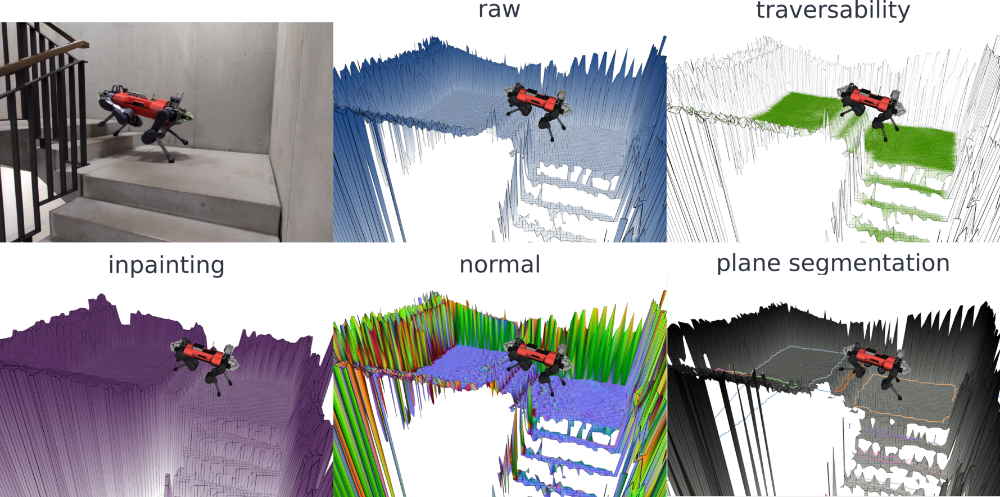

##################################################
Elevation Mapping CuPy ROS2 Documentation
##################################################

Welcome to the documentation for the official ROS2/Jazzy branch of
``elevation_mapping_cupy``.

.. image:: https://github.com/leggedrobotics/elevation_mapping_cupy/actions/workflows/jazzy-docker-tests.yml/badge.svg
    :target: https://github.com/leggedrobotics/elevation_mapping_cupy/actions/workflows/jazzy-docker-tests.yml
    :alt: ROS2 CI

.. image:: https://github.com/leggedrobotics/elevation_mapping_cupy/actions/workflows/documentation.yml/badge.svg
    :target: https://github.com/leggedrobotics/elevation_mapping_cupy/actions/workflows/documentation.yml
    :alt: Documentation

This documentation tracks the ``ros2`` branch, which is the actively maintained
ROS2/Jazzy line. The legacy ROS1 line remains on ``main``.

Highlights
---------------

* GPU-accelerated elevation mapping with CuPy.
* Geometry, RGB, semantic image, and semantic pointcloud fusion.
* ROS2 launch files and tests validated on a self-hosted NVIDIA runner.
* Maintained ROS2 branch owner: Lorenzo Terenzi.

Start here
---------------

| :doc:`getting_started/introduction` - Branch scope, map inputs, and supported features
| :doc:`getting_started/installation` - ROS2 Jazzy installation and build
| :doc:`getting_started/tutorial` - Launching the node, TurtleBot3 demo, and semantic demos
| :doc:`release_notes/jazzy_release` - ROS2 Jazzy release status and validation summary

The legacy plane-segmentation stack is not part of the current ROS2 workspace.
The supported release surface for this branch is the Python/CuPy elevation
mapping pipeline plus the restored ``semantic_sensor`` package.

.. image:: ../media/main_mem.png
    :alt: Multi-modal elevation mapping overview

Citing
---------------
If you use ``elevation_mapping_cupy``, please cite the following paper:
Elevation Mapping for Locomotion and Navigation using GPU

.. hint::

    Elevation Mapping for Locomotion and Navigation using GPU `IROS 2022 paper <https://arxiv.org/abs/2204.12876>`_

    Takahiro Miki, Lorenz Wellhausen, Ruben Grandia, Fabian Jenelten, Timon Homberger, Marco Hutter

.. code-block::

    @misc{mikielevation2022,
        doi = {10.48550/ARXIV.2204.12876},
        author = {Miki, Takahiro and Wellhausen, Lorenz and Grandia, Ruben and Jenelten, Fabian and Homberger, Timon and Hutter, Marco},
        keywords = {Robotics (cs.RO), FOS: Computer and information sciences, FOS: Computer and information sciences},
        title = {Elevation Mapping for Locomotion and Navigation using GPU},
        publisher = {International Conference on Intelligent Robots and Systems (IROS)},
        year = {2022},
    }

Multi-modal elevation mapping if you use color or semantic layers

.. hint::

    MEM: Multi-Modal Elevation Mapping for Robotics and Learning `MEM paper <https://arxiv.org/abs/2309.16818v1>`_

    Gian Erni, Jonas Frey, Takahiro Miki, Matias Mattamala, Marco Hutter

.. code-block::

    @misc{Erni2023-bs,
        title = "{MEM}: {Multi-Modal} Elevation Mapping for Robotics and Learning",
        author = "Erni, Gian and Frey, Jonas and Miki, Takahiro and Mattamala, Matias and Hutter, Marco",
        publisher = {International Conference on Intelligent Robots and Systems (IROS)},
        year = {2023},
    }
