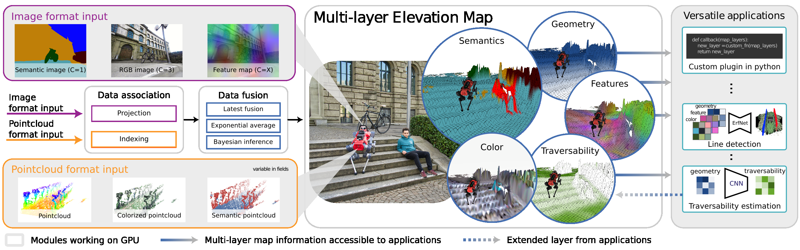

.. _introduction:

Introduction
******************************************************************
``elevation_mapping_cupy`` is a GPU-accelerated elevation mapping stack for ROS2.
It fuses geometry and optional semantic inputs into a grid map that can be
published to planners, visualizers, and downstream perception components.

This documentation describes the official ``ros2`` branch for ROS2 Jazzy.
The ``main`` branch remains the legacy ROS1 line.

What This Branch Covers
-------------------------------------------------------------------

* Core elevation mapping in Python with CuPy-backed map updates.
* Pointcloud fusion, image fusion, and plugin-based post-processing.
* Semantic fusion through the in-repo ``semantic_sensor`` package.
* TurtleBot3 example launches and integration tests validated on ROS2 Jazzy.

What is not part of the supported ROS2 release surface:

* The historical ROS1/catkin workflow.
* The legacy plane-segmentation stack.
* The experimental ``ros2_cpp`` branch.

Used for Various Real-World Applications
-------------------------------------------------------------------
This software package has been used in challenging locomotion and exploration
settings, from subterranean navigation to multi-modal terrain perception.

* **DARPA Subterranean Challenge**: This package was used by Team CERBERUS in the DARPA Subterranean Challenge.

  `Team Cerberus <https://www.subt-cerberus.org/>`_

  `CERBERUS in the DARPA Subterranean Challenge (Science Robotics) <https://www.science.org/doi/10.1126/scirobotics.abp9742>`_

* **ESA / ESRIC Space Resources Challenge**: This package was used for the Space Resources Challenge.

  `Scientific exploration of challenging planetary analog environments with a team of legged robots (Science Robotics) <https://www.science.org/doi/full/10.1126/scirobotics.ade9548>`_

Key Features
-------------------------------------------------------------------
* **Height Drift Compensation**: Tackles state estimation drifts that can create mapping artifacts, ensuring more accurate terrain representation.

* **Visibility Cleanup and Artifact Removal**: Raycasting methods and an exclusion zone feature are designed to remove virtual artifacts and correctly interpret overhanging obstacles.

* **Learning-based Traversability Filter**: Assesses terrain traversability using local geometry, improving path planning and navigation.

* **Multi-Modal Elevation Map (MEM) Framework**: Allows seamless integration of diverse data like geometry, semantics, and RGB information.

* **GPU-Enhanced Efficiency**: Facilitates rapid processing of large data structures, crucial for real-time applications.

Overview
-------------------------------------------------------------------

Overview of the multi-modal elevation map structure. The framework takes
multi-modal images and point clouds as input, associates the data with grid
cells, fuses each channel into map layers, and optionally runs plugins to derive
secondary layers such as traversability or semantic visualizations.

Subscribed Topics
-------------------------------------------------------------------
The subscribed topics are configured under the ``subscribers`` section of the
robot setup YAML. A reference configuration is available in
``elevation_mapping_cupy/config/core/example_setup.yaml``.

* **/<point_cloud_topic>** (``sensor_msgs/msg/PointCloud2``)

  The point cloud topic. It can have additional channels for RGB, intensity, and semantic values.

* **/<image_topic>** (``sensor_msgs/msg/Image``)

  The image topic. It can carry RGB, semantic probabilities, or feature images.

* **/<camera_info>** (``sensor_msgs/msg/CameraInfo``)

  Camera intrinsics used to project map updates from image space.

* **/<channel_info>** (``elevation_map_msgs/msg/ChannelInfo``)

  Optional channel metadata used to associate image channels with map layers.

* **/tf** and **/tf_static** (ROS2 TF topics)

  Transform tree used to place sensor observations in the map frame.

Published Topics
-------------------------------------------------------------------
Published topics are configured in the ``publishers`` section of the robot setup
YAML. Each publisher specifies a topic name, a layer list, a ``basic_layers``
subset for valid-cell handling, and an output rate.

.. code-block:: yaml

  publishers:
      your_topic_name:
        layers: [ 'list_of_layer_names', 'layer1', 'layer2' ]
        basic_layers: [ 'list of basic layers', 'layer1' ]
        fps: 5.0

* **elevation_map_raw** (``grid_map_msgs/msg/GridMap``)

  The entire elevation map.

* **elevation_map_recordable** (``grid_map_msgs/msg/GridMap``)

  The entire elevation map with slower update rate for visualization and logging.

* **elevation_map_filter** (``grid_map_msgs/msg/GridMap``)

  The filtered maps using plugins.

Semantics Support
-------------------------------------------------------------------
The semantics workflow consists of two stages:

* A vision model or semantic sensor node produces semantic channels or feature channels.
* ``elevation_mapping_cupy`` fuses those channels into map layers according to the configured fusion mode.

This branch includes two supported semantic entry points:

* **Semantic image fusion** through image topics plus ``ChannelInfo`` metadata.
* **Semantic pointcloud fusion** through multi-channel point clouds generated by ``semantic_sensor``.
