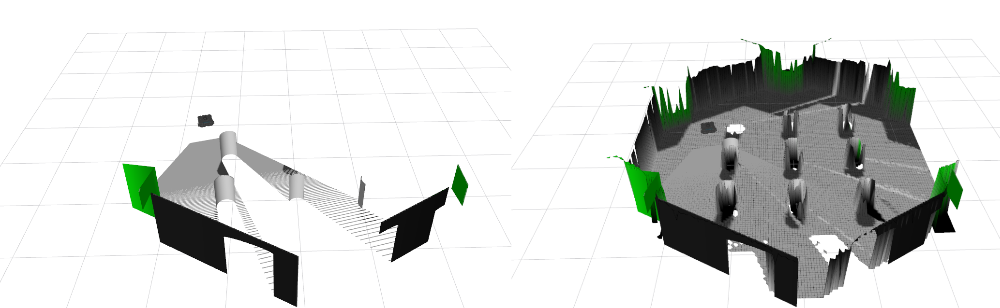

.. _tutorial:

Tutorial
******************************************************************
This tutorial covers the launch files that are part of the supported ROS2/Jazzy
surface of the ``ros2`` branch.

If you want to implement your own post-processing layers, refer to
:ref:`plugins`.

Launch the Core Node
==================================================================

The generic launch file accepts a robot-specific config under
``config/setups/``.

.. code-block:: bash

  source /opt/ros/jazzy/setup.bash
  source ~/ros2_ws/install/setup.bash

  ros2 launch elevation_mapping_cupy elevation_mapping.launch.py \
    robot_config:=menzi/base.yaml \
    launch_rviz:=false

Use a different setup YAML when targeting another robot:

.. code-block:: bash

  ros2 launch elevation_mapping_cupy elevation_mapping.launch.py \
    robot_config:=turtle_bot/turtle_bot_simple.yaml \
    launch_rviz:=true

Run the TurtleBot3 Example
==================================================================

Install the simulation packages first:

.. code-block:: bash

  sudo apt install ros-jazzy-turtlebot3-gazebo ros-jazzy-turtlebot3-teleop

Then launch the TurtleBot3 example:

.. code-block:: bash

  export TURTLEBOT3_MODEL=waffle
  ros2 launch elevation_mapping_cupy elevation_mapping_turtle.launch.py

Open a second terminal to drive the robot:

.. code-block:: bash

  source /opt/ros/jazzy/setup.bash
  source ~/ros2_ws/install/setup.bash
  export TURTLEBOT3_MODEL=waffle
  ros2 run turtlebot3_teleop teleop_keyboard

The usual teleop bindings apply: ``w``, ``a``, ``s``, ``d``, and ``x``.

Run the Semantic Demos
==================================================================

The semantic workflow is split into two stages:

* ``semantic_sensor`` generates semantic channels from image or pointcloud
  inputs.
* ``elevation_mapping_cupy`` fuses those channels into map layers.

Pointcloud semantic demo:

.. code-block:: bash

  ros2 launch elevation_mapping_cupy turtlesim_semantic_pointcloud_example.launch.py

Image semantic demo:

.. code-block:: bash

  ros2 launch elevation_mapping_cupy turtlesim_semantic_image_example.launch.py

Both launches were restored and revalidated on the ROS2 branch. They require
the ``semantic_sensor`` package to be built and sourced, and the image demo may
require a local ``torchvision`` install that matches your PyTorch/CUDA build.

Test the Launch Surface
==================================================================

The release process includes explicit checks for the shipped launches. You can
run the same coverage locally.

Launch description checks:

.. code-block:: bash

  ros2 launch elevation_mapping_cupy turtlesim_semantic_image_example.launch.py --print-description
  ros2 launch elevation_mapping_cupy turtlesim_semantic_pointcloud_example.launch.py --print-description

Semantic launch tests:

.. code-block:: bash

  colcon test --packages-select elevation_mapping_cupy \
    --ctest-args -R test_semantic_launch_descriptions

Troubleshooting
==================================================================

Missing GPU or ``libcuda.so.1``:

.. code-block:: bash

  nvidia-smi
  python3 -c "import cupy as cp; print(cp.cuda.runtime.getDeviceCount())"

Missing ``torchvision`` for the semantic demos:

.. code-block:: bash

  python3 -m pip install torchvision

DDS discovery problems in integration tests:

.. code-block:: bash

  ros2 daemon stop
  FASTDDS_BUILTIN_TRANSPORTS=UDPv4 python3 -m launch_testing.launch_test \
    src/elevation_mapping_cupy/elevation_mapping_cupy/test/test_tf_gridmap_integration.py
